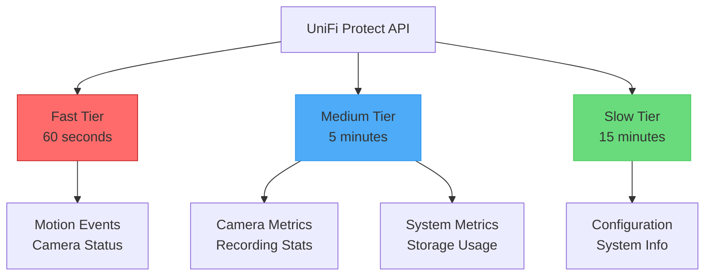

# Metrics Overview

The UniFi Protect Exporter provides comprehensive metrics across all aspects of your UniFi Protect infrastructure. This guide explains the metric collection system and available metrics.

## Collection Tiers

The exporter uses a three-tier system to optimize API usage and provide timely data:



### Fast Tier (60 seconds)
- **Purpose**: Real-time event monitoring
- **Metrics**: Motion detection events, camera online/offline status
- **Use Case**: Real-time security monitoring, motion alerts

### Medium Tier (5 minutes)
- **Purpose**: Standard operational metrics
- **Metrics**: Camera statistics, recording quality, storage usage
- **Use Case**: Operational dashboards, performance monitoring

### Slow Tier (15 minutes)
- **Purpose**: Configuration and slowly changing data
- **Metrics**: System configuration, device information
- **Use Case**: Inventory tracking, configuration monitoring

## Metric Naming Convention

All metrics follow Prometheus best practices:

```
unifi_protect_<category>_<metric>_<unit>
```

Examples:
- `unifi_protect_camera_total` - Total camera count
- `unifi_protect_motion_events_total` - Total motion events
- `unifi_protect_storage_used_bytes` - Storage usage in bytes

## Metric Types

### Gauges
Most metrics are gauges representing current values:
- Camera status (0/1)
- Storage usage
- Recording quality
- System resource usage

### Counters
Some metrics are counters that only increase:
- Motion event counts
- Recording failures
- API call counts

### Info Metrics
Informational metrics with labels:
- `unifi_protect_system_info` - System details
- `unifi_protect_camera_info` - Camera information

## Common Labels

All metrics include relevant labels for filtering and grouping:

| Label | Description | Example |
|-------|-------------|---------|
| `nvr_id` | NVR ID | `12345678` |
| `nvr_name` | NVR name | `Main NVR` |
| `camera_id` | Camera ID | `abcd1234` |
| `camera_name` | Camera name | `Front Door` |
| `camera_model` | Camera model | `G4 Pro` |
| `camera_type` | Camera type | `UVC G4 PRO` |

## Metric Categories

<div class="grid cards" markdown>

- :material-server: **System Metrics**
  NVR health, storage usage, resource utilization

- :material-camera: **Camera Metrics**
  Status, recording quality, connection state

- :material-motion-sensor: **Motion Metrics**
  Motion events, smart detections, event duration

- :material-record: **Recording Metrics**
  Recording status, quality, storage per camera

- :material-cog: **Configuration Metrics**
  System settings, device configuration

</div>

## API Alignment

The exporter is designed to work efficiently with UniFi Protect's API:

### Data Freshness
- **Real-time updates**: WebSocket connection for instant events
- **Periodic polling**: Regular API calls for statistics
- **Efficient caching**: Minimize API load

### Connection Management
- Automatic reconnection on failures
- Configurable timeout and retry logic
- SSL certificate handling for self-signed certs

### Event Handling
- Real-time motion event processing
- Smart detection events (person, vehicle, package)
- Event aggregation and rate calculation

## Performance Metrics

The exporter tracks its own performance:

```prometheus
# Collection duration
unifi_protect_collector_duration_seconds{collector="camera"} 1.5

# API calls made
unifi_protect_collector_api_calls_total{collector="system"} 42

# Collection errors
unifi_protect_collector_errors_total{collector="motion"} 0

# Last successful collection
unifi_protect_collector_last_success_timestamp_seconds{collector="recording"} 1705320000
```

## Best Practices

### 1. Use Appropriate Queries
```promql
# Good: Rate calculation for motion events
rate(unifi_protect_motion_events_total[5m])

# Good: Alert on camera offline
unifi_protect_camera_up == 0
```

### 2. Label Filtering
```promql
# Filter by camera
unifi_protect_camera_up{camera_name="Front Door"}

# Filter by camera model
unifi_protect_camera_up{camera_model=~"G4.*"}
```

### 3. Aggregation
```promql
# Total cameras by model
sum by (camera_model) (unifi_protect_camera_up)

# Average storage usage per camera
avg by (camera_name) (unifi_protect_camera_storage_bytes)
```

## Grafana Integration

Example queries for common dashboards:

### Camera Status Overview
```promql
sum by (camera_model) (unifi_protect_camera_up)
```

### Motion Event Rate
```promql
rate(unifi_protect_motion_events_total{camera_name="$camera"}[5m])
```

### Storage Usage
```promql
(unifi_protect_storage_used_bytes / unifi_protect_storage_total_bytes) * 100
```

## Next Steps

- Explore the [Complete Metrics Reference](metrics.md) for detailed metric information
- Learn about [Integration & Dashboards](../integration-dashboards.md) for visualization setup
- Set up [Deployment & Operations](../deployment-operations.md) for production monitoring
- Configure alerts using the examples in [Integration & Dashboards](../integration-dashboards.md)